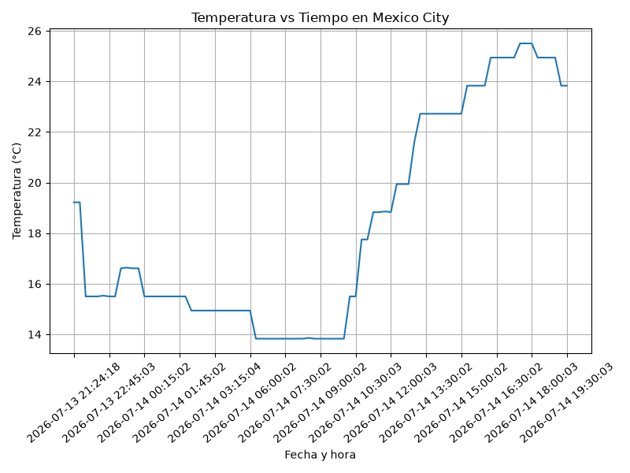
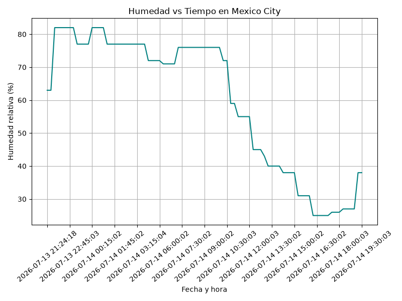
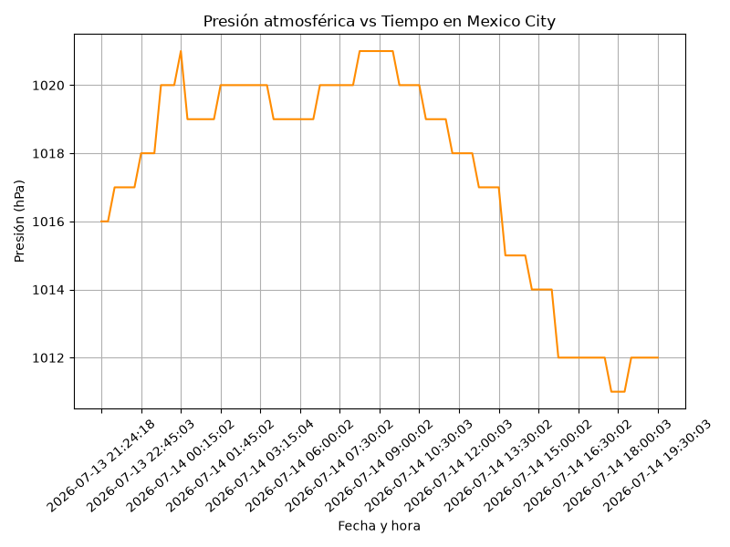

#+options: ':nil *:t -:t ::t <:t H:3 \n:nil ^:t arch:headline
#+options: author:t broken-links:nil c:nil creator:nil
#+options: d:(not "LOGBOOK") date:t e:t email:nil expand-links:t f:t
#+options: inline:t num:t p:nil pri:nil prop:nil stat:t tags:t
#+options: tasks:t tex:t timestamp:t title:t toc:t todo:t |:t
#+title: Proyecto ICCD332: City Weather APP - Ciudad de México
#+date: 2026-07-13
#+author: Grupo 3
#+language: es
#+select_tags: export
#+exclude_tags: noexport

* Navegación
- [[file:index.org][Página principal: City Weather APP]]
- [[file:ieee754.org][Página 2: Representación IEEE 754]]
- [[file:seguridad.org][Página 3: Análisis INEC - Robo a Domicilio]]

* City Weather APP
Este es nuestro proyecto de fin de semestre en donde se demuestran las
destrezas obtenidas durante el transcurso de la asignatura de
*Arquitectura de Computadores*:

1. Conocimientos de sistema operativo Linux
2. Conocimientos de Emacs/Jupyter
3. Configuración de Entorno para Data Science con Mamba/Anaconda
4. Literate Programming

La ciudad objeto de estudio del *Grupo 3* es *Ciudad de México*
(lat: 19.4326, lon: -99.1332).

** Estructura del proyecto
El proyecto se creó en el /home/ del sistema operativo, en la carpeta
/MexicoWeather/:

#+begin_src shell :results output :exports both
pwd
#+end_src

#+RESULTS:
: /home/anthonio/MexicoWeather/weather-site/content

Estructura de archivos y subdirectorios del proyecto:

#+begin_src shell :results output :exports results
cd ../..
tree -I '.packages'
#+end_src

#+RESULTS:
#+begin_example
.
├── clima-mexico-hoy.csv
├── consultas-ia.md
├── Datos_de_Seguridad_Ecuador.xlsx
├── get-weather.sh
├── main.py
├── output.log
└── weather-site
    ├── build.sh
    ├── build-site.el
    ├── content
    │   ├── ieee754.org
    │   ├── images
    │   │   ├── humidity.png
    │   │   ├── pressure.png
    │   │   ├── robo_domicilio_anual.png
    │   │   ├── robo_domicilio_provincias.png
    │   │   └── temperature.png
    │   ├── index.org
    │   └── seguridad.org
    └── public
        ├── ieee754.html
        ├── images
        │   ├── humidity.png
        │   ├── pressure.png
        │   ├── robo_domicilio_anual.png
        │   ├── robo_domicilio_provincias.png
        │   └── temperature.png
        ├── index.html
        └── seguridad.html

6 directories, 24 files
#+end_example

** Formulación del Problema
Se desea realizar un registro climatológico de la Ciudad de México
$\mathcal{C}$. Para esto, se escribió un script de Python que permite
obtener datos climatológicos desde el API de [[https://openweathermap.org/current][openweathermap]], el API
hace uso de los valores de latitud $x$ y longitud $y$ de la ciudad
$\mathcal{C}$ para devolver los valores actuales a un tiempo $t$.

Los resultados obtenidos de la consulta al API se escriben en el
archivo /clima-mexico-hoy.csv/, cada ejecución del script almacena
nuevos datos en el archivo. Se utiliza *crontab* para obtener datos
con una periodicidad de 15 minutos mediante la ejecución del archivo
ejecutable /get-weather.sh/, respaldando la salida en /output.log/.

** Descripción del código
La estrategia de solución se divide en tres unidades funcionales:
(1) consulta al API, (2) normalización del JSON anidado a columnas
planas, y (3) escritura incremental al CSV.

*** Lectura del API
La función ~get_weather~ consulta el endpoint /Current Weather/ con
las coordenadas de la ciudad y devuelve la respuesta JSON como un
diccionario de Python:

#+begin_src python :exports code
def get_weather(lat, lon, api_key):
    """Consulta el API de OpenWeatherMap y devuelve el JSON como dict.
    Docs: https://openweathermap.org/current"""
    url = "https://api.openweathermap.org/data/2.5/weather"
    params = {"lat": lat, "lon": lon, "appid": api_key, "units": "metric"}
    response = requests.get(url, params=params, timeout=30)
    return response.json()
#+end_src

#+RESULTS:
: None

*** Convertir JSON a columnas planas
El JSON del API contiene diccionarios anidados (~main~, ~wind~, ~sys~)
y listas (~weather~), la función recursiva ~flatten~ los convierte en
claves planas con separador ~_~ (ej: ~main.temp~ → ~main_temp~). Esto
garantiza que *toda* la información del API quede en columnas, como
exige el enunciado, los campos ~rain~ y ~snow~, que solo aparecen
cuando existe el fenómeno, están declarados en la lista fija
~FIELDNAMES~, de modo que el CSV siempre tiene las mismas columnas y
quedan vacíos cuando el API no los envía:

#+begin_src python :exports code
def flatten(data, parent_key=""):
    """Aplana un diccionario anidado usando '_' como separador."""
    items = {}
    for key, value in data.items():
        new_key = f"{parent_key}_{key}" if parent_key else key
        if isinstance(value, dict):
            items.update(flatten(value, new_key))
        elif isinstance(value, list):
            for i, elem in enumerate(value):
                if isinstance(elem, dict):
                    items.update(flatten(elem, f"{new_key}_{i}"))
                else:
                    items[f"{new_key}_{i}"] = elem
        else:
            items[new_key] = value
    return items
#+end_src

#+RESULTS:
: None

*** Guardar el archivo csv
La función ~write2csv~ agrega una fila por ejecución y escribe el
encabezado únicamente si el archivo aún no existe:

#+begin_src python :exports code
def write2csv(data_dict, csv_filename):
    file_exists = os.path.isfile(csv_filename)
    with open(csv_filename, "a", newline="") as f:
        writer = csv.DictWriter(f, fieldnames=FIELDNAMES)
        if not file_exists:
            writer.writeheader()
        writer.writerow(data_dict)
#+end_src

#+RESULTS:
: None

** Script ejecutable sh
Ubicación del intérprete de shell y del entorno mamba /iccd332/
utilizado:

#+begin_src shell :results output :exports both
which bash
#+end_src

#+RESULTS:
: /usr/bin/bash

#+begin_src shell :results output :exports both
which mamba
#+end_src

#+RESULTS:
: /home/anthonio/miniforge3/condabin/mamba

Contenido del ejecutable /get-weather.sh/. Se usa ~#!/bin/bash~ (y no
~sh~/dash, que no dispone del comando ~source~), se activa el entorno
/iccd332/ y la API key se pasa como variable de entorno para no
exponerla en el código fuente:

#+begin_src shell :exports code
#!/bin/bash
cd "$(dirname "$0")" || exit 1
source "/home/anthonio/miniforge3/etc/profile.d/conda.sh"
eval "$(conda shell.bash hook)"
conda activate iccd332
export OWM_API_KEY="********"
python main.py
#+end_src

#+RESULTS:

El script se convirtió en ejecutable con:

#+begin_src shell :exports code
chmod +x get-weather.sh
#+end_src

#+RESULTS:

** Configuración de Crontab
Configuración realizada en crontab para la adquisición de datos cada
15 minutos:

#+begin_src shell :exports code
*/15 * * * * /home/anthonio/MexicoWeather/get-weather.sh >> /home/anthonio/MexicoWeather/output.log 2>&1
#+end_src

#+RESULTS:

- ~*/15~ ejecuta el script cada 15 minutos.
- ~>>~ agrega la salida al final de /output.log/ (lo crea si no existe).
- ~2>&1~ redirige también los errores al mismo archivo de log.

Verificación de la ejecución automática en /output.log/:

#+begin_src shell :results output :exports both
cd ../..
tail -n 5 output.log
#+end_src

#+RESULTS:
: ===== Mexico-Clima | Grupo 3 ICCD332 =====
: [OK] Dato guardado: 2026-07-14 19:15:03 | Mexico City | temp=23.83C | few clouds
: ===== Mexico-Clima | Grupo 3 ICCD332 =====
: [OK] Dato guardado: 2026-07-14 19:30:03 | Mexico City | temp=23.83C | few clouds

* Presentación de resultados
Para la presentación de resultados se utilizan las librerías de
Python *pandas* y *matplotlib*, instaladas en el entorno /iccd332/.

** Muestra Aleatoria de datos
Se presenta una muestra de 10 valores aleatorios de los datos
obtenidos. Primero se verifica la estructura del DataFrame
(filas x columnas):

#+caption: Lectura de archivo csv
#+begin_src python :session :results output :exports both
import pandas as pd
df = pd.read_csv('/home/anthonio/MexicoWeather/clima-mexico-hoy.csv')
print(df.shape)
#+end_src

#+RESULTS:
: (85, 35)

#+caption: Despliegue de datos aleatorios
#+begin_src python :session :exports both :results value table :return table
table1 = df.sample(10)
table = [list(table1)]+[None]+table1.values.tolist()
#+end_src

#+RESULTS:
| fecha_consulta      | coord_lon | coord_lat | weather_0_id | weather_0_main | weather_0_description | weather_0_icon | base     | main_temp | main_feels_like | main_temp_min | main_temp_max | main_pressure | main_humidity | main_sea_level | main_grnd_level | visibility | wind_speed | wind_deg | wind_gust | rain_1h | rain_3h | snow_1h | snow_3h | clouds_all | dt                  | sys_type |  sys_id | sys_country | sys_sunrise         | sys_sunset          | timezone |      id | name        | cod |
|---------------------+-----------+-----------+--------------+----------------+-----------------------+----------------+----------+-----------+-----------------+---------------+---------------+---------------+---------------+----------------+-----------------+------------+------------+----------+-----------+---------+---------+---------+---------+------------+---------------------+----------+---------+-------------+---------------------+---------------------+----------+---------+-------------+-----|
| 2026-07-14 00:00:03 |  -99.1332 |   19.4326 |          804 | Clouds         | overcast clouds       |            04n | stations |     16.61 |           16.34 |         16.61 |         16.61 |          1020 |            77 |           1020 |             766 |      10000 |       3.58 |      310 |       nan |     nan |     nan |     nan |     nan |         89 | 2026-07-13 23:53:26 |      2.0 | 47729.0 | MX          | 2026-07-13 07:05:48 | 2026-07-13 20:18:22 |   -21600 | 3530597 | Mexico City | 200 |
| 2026-07-14 11:00:02 |  -99.1277 |   19.4285 |          802 | Clouds         | scattered clouds      |            03d | stations |     17.75 |           17.12 |         17.75 |         17.75 |          1019 |            59 |           1019 |             766 |      10000 |       1.67 |       52 |      0.96 |     nan |     nan |     nan |     nan |         41 | 2026-07-14 10:50:40 |      2.0 | 47729.0 | MX          | 2026-07-14 07:06:09 | 2026-07-14 20:18:11 |   -21600 | 3530597 | Mexico City | 200 |
| 2026-07-14 10:45:02 |  -99.1294 |   19.4287 |          802 | Clouds         | scattered clouds      |            03d | stations |     17.75 |           17.12 |         17.75 |         17.75 |          1019 |            59 |           1019 |             766 |      10000 |       1.67 |       52 |      0.96 |     nan |     nan |     nan |     nan |         41 | 2026-07-14 10:44:38 |      2.0 | 47729.0 | MX          | 2026-07-14 07:06:09 | 2026-07-14 20:18:12 |   -21600 | 3530597 | Mexico City | 200 |
| 2026-07-14 16:30:02 |  -99.1332 |   19.4326 |          800 | Clear          | clear sky             |            01d | stations |     24.94 |           24.14 |         24.94 |         24.94 |          1012 |            25 |           1012 |             764 |      10000 |       2.68 |      100 |       nan |     nan |     nan |     nan |     nan |          3 | 2026-07-14 16:26:10 |      2.0 | 47729.0 | MX          | 2026-07-14 07:06:10 | 2026-07-14 20:18:13 |   -21600 | 3530597 | Mexico City | 200 |
| 2026-07-14 13:15:02 |  -99.1332 |   19.4326 |          802 | Clouds         | scattered clouds      |            03d | stations |     22.72 |           22.09 |         22.72 |         22.72 |          1017 |            40 |           1017 |             766 |      10000 |       1.79 |       60 |       nan |     nan |     nan |     nan |     nan |         32 | 2026-07-14 13:05:20 |      2.0 | 47729.0 | MX          | 2026-07-14 07:06:10 | 2026-07-14 20:18:13 |   -21600 | 3530597 | Mexico City | 200 |
| 2026-07-14 08:45:03 |  -99.1332 |   19.4326 |          803 | Clouds         | broken clouds         |            04d | stations |     13.83 |           13.25 |         13.83 |         13.83 |          1021 |            76 |           1021 |             767 |      10000 |       1.79 |       90 |       nan |     nan |     nan |     nan |     nan |         56 | 2026-07-14 08:42:49 |      2.0 | 47729.0 | MX          | 2026-07-14 07:06:10 | 2026-07-14 20:18:13 |   -21600 | 3530597 | Mexico City | 200 |
| 2026-07-14 08:30:02 |  -99.1277 |   19.4285 |          803 | Clouds         | broken clouds         |            04d | stations |     13.86 |           13.29 |         13.86 |         13.86 |          1021 |            76 |           1021 |             766 |      10000 |       1.79 |       90 |       nan |     nan |     nan |     nan |     nan |         70 | 2026-07-14 08:21:17 |      2.0 | 47729.0 | MX          | 2026-07-14 07:06:09 | 2026-07-14 20:18:11 |   -21600 | 3530597 | Mexico City | 200 |
| 2026-07-14 00:15:02 |  -99.1332 |   19.4326 |          804 | Clouds         | overcast clouds       |            04n | stations |      15.5 |           15.25 |          15.5 |          15.5 |          1021 |            82 |           1021 |             766 |      10000 |       1.79 |      320 |       nan |     nan |     nan |     nan |     nan |         89 | 2026-07-14 00:05:02 |      2.0 | 47729.0 | MX          | 2026-07-13 07:05:48 | 2026-07-13 20:18:22 |   -21600 | 3530597 | Mexico City | 200 |
| 2026-07-13 21:24:18 |  -99.1332 |   19.4326 |          500 | Rain           | light rain            |            10n | stations |     19.22 |           18.84 |         19.22 |         19.22 |          1016 |            63 |           1016 |             765 |      10000 |       0.79 |      179 |      1.48 |     0.4 |     nan |     nan |     nan |         89 | 2026-07-13 21:14:35 |      nan |     nan | MX          | 2026-07-13 07:05:48 | 2026-07-13 20:18:22 |   -21600 | 3530597 | Mexico City | 200 |
| 2026-07-13 22:15:04 |  -99.1332 |   19.4326 |          500 | Rain           | light rain            |            10n | stations |      15.5 |           15.25 |          15.5 |          15.5 |          1017 |            82 |           1017 |             766 |      10000 |       2.68 |      280 |       nan |    0.48 |     nan |     nan |     nan |         95 | 2026-07-13 22:10:19 |      2.0 | 47729.0 | MX          | 2026-07-13 07:05:48 | 2026-07-13 20:18:22 |   -21600 | 3530597 | Mexico City | 200 |

** Gráfica Temperatura vs Tiempo
#+begin_src python :results file :exports both :session
import matplotlib.pyplot as plt
fig = plt.figure(figsize=(8,6))
plt.plot(df['fecha_consulta'], df['main_temp'])
plt.grid()
plt.title(f'Temperatura vs Tiempo en {next(iter(set(df.name)))}')
plt.xlabel('Fecha y hora')
plt.ylabel('Temperatura (°C)')
# mostrar 1 de cada 6 etiquetas del eje x para que no se encimen
ax = plt.gca()
ax.set_xticks(ax.get_xticks()[::6])
plt.xticks(rotation=40)
fig.tight_layout()
fname = './images/temperature.png'
plt.savefig(fname)
fname
#+end_src

#+RESULTS:

** Gráfica de Humedad con respecto al tiempo
#+begin_src python :results file :exports both :session
fig = plt.figure(figsize=(8,6))
plt.plot(df['fecha_consulta'], df['main_humidity'], color='teal')
plt.grid()
plt.title(f'Humedad vs Tiempo en {next(iter(set(df.name)))}')
plt.xlabel('Fecha y hora')
plt.ylabel('Humedad relativa (%)')
ax = plt.gca()
ax.set_xticks(ax.get_xticks()[::6])
plt.xticks(rotation=40)
fig.tight_layout()
fname = './images/humidity.png'
plt.savefig(fname)
fname
#+end_src

#+RESULTS:

** Gráfica de interés (Presión atmosférica)
#+begin_src python :results file :exports both :session
fig = plt.figure(figsize=(8,6))
plt.plot(df['fecha_consulta'], df['main_pressure'], color='darkorange')
plt.grid()
plt.title(f'Presión atmosférica vs Tiempo en {next(iter(set(df.name)))}')
plt.xlabel('Fecha y hora')
plt.ylabel('Presión (hPa)')
ax = plt.gca()
ax.set_xticks(ax.get_xticks()[::6])
plt.xticks(rotation=40)
fig.tight_layout()
fname = './images/pressure.png'
plt.savefig(fname)
fname
#+end_src

#+RESULTS:

* Referencias
- [[https://openweathermap.org/current][API OpenWeatherMap - Current Weather Data]]
- [[https://docs.python.org/3/library/csv.html#csv.DictWriter][Documentación de csv.DictWriter - Python]]
- [[https://requests.readthedocs.io/en/latest/user/quickstart/][Librería requests - Quickstart]]
- [[https://stackoverflow.com/questions/6027558/flatten-nested-dictionaries-compressing-keys][Aplanar diccionarios anidados - StackOverflow]]
- [[https://stackoverflow.com/questions/34534513/calling-conda-source-activate-from-bash-script][Activar conda desde un script bash - StackOverflow]]
- [[https://emacs.stackexchange.com/questions/28715/get-pandas-data-frame-as-a-table-in-org-babel][Presentar DataFrame como tabla en org-babel]]
- [[https://orgmode.org/worg/org-contrib/babel/languages/ob-doc-python.html][Python Source Code Blocks in Org Mode]]
- [[https://systemcrafters.net/publishing-websites-with-org-mode/building-the-site/][System Crafters: Publishing Websites with Org Mode]]
