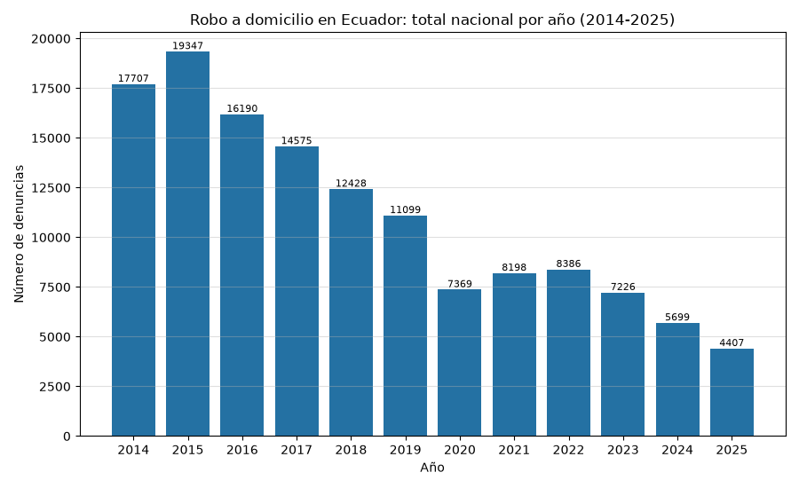
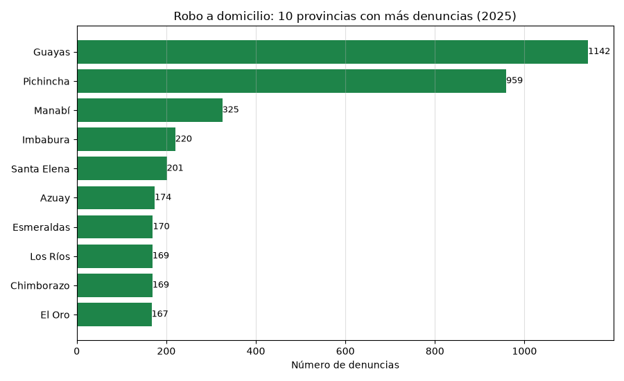

#+options: ':nil *:t -:t ::t <:t H:3 \n:nil ^:t arch:headline
#+options: author:t broken-links:nil c:nil creator:nil
#+options: d:(not "LOGBOOK") date:t e:t email:nil f:t inline:t num:t
#+options: p:nil pri:nil prop:nil stat:t tags:t tasks:t tex:t
#+options: timestamp:t title:t toc:t todo:t |:t
#+title: Análisis de Cifras de Seguridad INEC: Robo a Domicilio
#+date: 2026-07-14
#+author: Grupo 3
#+language: es
#+select_tags: export
#+exclude_tags: noexport

[[file:index.org][Inicio]] | [[file:ieee754.org][Representación IEEE 754]]

* Introducción
En esta página se presenta un breve análisis de las estadísticas de
*robo a domicilio* en Ecuador, a partir de los datos abiertos del
Instituto Nacional de Estadística y Censos (INEC) publicados en las
/Estadísticas de Seguridad Integral: Delitos de mayor connotación
psicosocial/ (corte: febrero 2026).

Según el INEC, el *robo a domicilio* es el "evento que se caracteriza
cuando una persona o grupo de personas ingrese a un domicilio ajeno
mediante amenazas, violentando o haciendo uso de la fuerza con el fin
de sustraer o apoderarse de un bien u objeto que se encuentre en el
domicilio o sea parte del bien inmueble, excepto vehículos a motor"
(Manual de Conceptualización de Indicadores de Seguridad Ciudadana y
Convivencia Pacífica desde el Enfoque de la Prevención, 2015).

* Descripción de los datos y su procesamiento
El archivo /Datos_de_Seguridad_Ecuador.xlsx/ contiene 13 hojas con los
delitos de mayor connotación. Se utiliza la hoja *10.robo_domicilio*,
que registra el número de *denuncias* de robo a domicilio por *cantón
de ocurrencia*, con una columna por mes desde enero 2014 hasta febrero
2026 (146 meses, 221 cantones).

El procesamiento con *pandas* consiste en:
1. Leer la hoja indicando que el encabezado está en la fila 4
   (~header=3~) y descartar la primera columna vacía.
2. Renombrar las tres columnas de identificación (provincia, código
   DPA, cantón) y eliminar filas sin provincia.
3. Separar la fila /Total Nacional/ del detalle cantonal para no
   duplicar los totales.
4. Agregar por mes (serie nacional), por año y por provincia.

*Validación:* la serie obtenida se contrastó con dos fuentes: (a) la
fila /Total Nacional/ del propio Excel y (b) la presentación oficial
del INEC de febrero 2026, que reporta 721 denuncias en enero-febrero
2025, 630 en enero-febrero 2026 (variación de -12,6%) y 4.407 en el
total de 2025. Los tres valores coinciden con los calculados.

** Carga y limpieza de los datos
#+begin_src python :session :results output :exports both
# Fuentes:
# - pandas.read_excel: https://pandas.pydata.org/docs/reference/api/pandas.read_excel.html
# - INEC, Estadisticas de Seguridad Integral: https://www.ecuadorencifras.gob.ec/justicia-y-crimen/
import pandas as pd
from datetime import datetime

RUTA = '/home/anthonio/MexicoWeather/Datos_de_Seguridad_Ecuador.xlsx'

df = pd.read_excel(RUTA, sheet_name='10.robo_domicilio', header=3)
df = df.drop(columns=df.columns[0])          # primera columna vacia
df = df.rename(columns={df.columns[0]: 'provincia',
                        df.columns[1]: 'codigo_canton',
                        df.columns[2]: 'canton'})
df = df.dropna(subset=['provincia'])

# Separar la fila de Total Nacional del detalle por canton
total_row = df[df['provincia'] == 'Total Nacional']
df = df[df['provincia'] != 'Total Nacional']

# Columnas de meses (son objetos datetime en el encabezado)
month_cols = [c for c in df.columns if isinstance(c, datetime)]
print(f"Cantones: {len(df)} | Meses: {len(month_cols)} "
      f"({month_cols[0].date()} a {month_cols[-1].date()})")
#+end_src

#+RESULTS:
: Cantones: 221 | Meses: 146 (2014-01-01 a 2026-02-01)

** Validación de la serie nacional
#+begin_src python :session :results output :exports both
serie = df[month_cols].sum()
serie.index = pd.to_datetime(serie.index)

# (a) contraste con la fila Total Nacional del Excel
serie_total = total_row[month_cols].iloc[0]
serie_total.index = pd.to_datetime(serie_total.index)
print("Suma de cantones == fila Total Nacional:", (serie == serie_total).all())

# (b) contraste con la presentacion oficial INEC feb-2026
print("Ene-Feb 2025:", int(serie['2025-01-01'] + serie['2025-02-01']), "(INEC: 721)")
print("Ene-Feb 2026:", int(serie['2026-01-01'] + serie['2026-02-01']), "(INEC: 630)")
print("Total 2025  :", int(serie[serie.index.year == 2025].sum()), "(INEC: 4.407)")
#+end_src

#+RESULTS:
: Suma de cantones == fila Total Nacional: True
: Ene-Feb 2025: 721 (INEC: 721)
: Ene-Feb 2026: 630 (INEC: 630)
: Total 2025  : 4407 (INEC: 4.407)

* Resultados
** Tabla 1: Total nacional de denuncias por año
#+begin_src python :session :exports both :results value table :return tabla_anual
anual = serie.groupby(serie.index.year).sum().astype(int)
var = anual.pct_change().mul(100).round(1)
tabla_anual = [["Año", "Denuncias", "Variación %"]] + [None] + \
    [[int(a), int(v), ("" if pd.isna(p) else f"{p:+.1f}%")]
     for a, v, p in zip(anual.index, anual.values, var.values)]
#+end_src

#+RESULTS:
|  Año | Denuncias | Variación % |
|------+-----------+-------------|
| 2014 |     17707 |             |
| 2015 |     19347 |       +9.3% |
| 2016 |     16190 |      -16.3% |
| 2017 |     14575 |      -10.0% |
| 2018 |     12428 |      -14.7% |
| 2019 |     11099 |      -10.7% |
| 2020 |      7369 |      -33.6% |
| 2021 |      8198 |      +11.2% |
| 2022 |      8386 |       +2.3% |
| 2023 |      7226 |      -13.8% |
| 2024 |      5699 |      -21.1% |
| 2025 |      4407 |      -22.7% |
| 2026 |       630 |      -85.7% |

** Tabla 2: Diez provincias con más denuncias en 2025
#+begin_src python :session :exports both :results value table :return tabla_prov
cols2025 = [c for c in month_cols if c.year == 2025]
top_prov = (df.groupby('provincia')[cols2025].sum().sum(axis=1)
              .sort_values(ascending=False).head(10).astype(int))
tabla_prov = [["Provincia", "Denuncias 2025"]] + [None] + \
    [[prov, int(val)] for prov, val in top_prov.items()]
#+end_src

#+RESULTS:
| Provincia   | Denuncias 2025 |
|-------------+----------------|
| Guayas      |           1142 |
| Pichincha   |            959 |
| Manabí      |            325 |
| Imbabura    |            220 |
| Santa Elena |            201 |
| Azuay       |            174 |
| Esmeraldas  |            170 |
| Chimborazo  |            169 |
| Los Ríos    |            169 |
| El Oro      |            167 |

** Gráfico 1: Evolución anual del robo a domicilio (2014-2025)
Se excluye 2026 por estar incompleto (solo enero-febrero disponibles).

#+begin_src python :session :results file :exports both
import matplotlib.pyplot as plt

anual_full = anual[anual.index <= 2025]
fig = plt.figure(figsize=(9, 5.5))
bars = plt.bar(anual_full.index.astype(str), anual_full.values, color='#2471a3')
plt.bar_label(bars, fontsize=8)
plt.title('Robo a domicilio en Ecuador: total nacional por año (2014-2025)')
plt.xlabel('Año')
plt.ylabel('Número de denuncias')
plt.grid(axis='y', alpha=0.4)
fig.tight_layout()
fname = './images/robo_domicilio_anual.png'
plt.savefig(fname)
fname
#+end_src

#+RESULTS:

** Gráfico 2: Provincias con más denuncias en 2025
#+begin_src python :session :results file :exports both
top10 = top_prov.sort_values(ascending=True)  # barh ordena de abajo hacia arriba
fig = plt.figure(figsize=(9, 5.5))
bars = plt.barh(top10.index, top10.values, color='#1e8449')
plt.bar_label(bars, fontsize=9)
plt.title('Robo a domicilio: 10 provincias con más denuncias (2025)')
plt.xlabel('Número de denuncias')
plt.grid(axis='x', alpha=0.4)
fig.tight_layout()
fname = './images/robo_domicilio_provincias.png'
plt.savefig(fname)
fname
#+end_src

#+RESULTS:

* Interpretación de resultados
Del procesamiento de los datos se destacan tres hallazgos:

1. *Tendencia decreciente sostenida:* las denuncias de robo a
   domicilio a nivel nacional pasaron de 19.347 en 2015 (año pico de
   la serie) a 4.407 en 2025, una reducción acumulada de
   aproximadamente el 77%. La caída más pronunciada ocurre en 2020
   (7.369 denuncias), año de las restricciones de movilidad por la
   pandemia, con un repunte parcial en 2021-2022 y nuevos descensos
   desde 2023.

2. *Continuidad de la tendencia en 2026:* el acumulado enero-febrero
   2026 (630 denuncias) es 12,6% menor al del mismo período de 2025
   (721), consistente con la variación reportada oficialmente por el
   INEC.

3. *Concentración territorial:* Guayas (1.142) y Pichincha (959)
   concentran cerca de la mitad de las denuncias de 2025, lo cual es
   coherente con su peso poblacional; los cantones Quito (808) y
   Guayaquil (696) encabezan el detalle cantonal.

*Limitación metodológica:* la fuente registra /denuncias/ ante la
Fiscalía General del Estado (SIAF), no hechos ocurridos; parte de la
disminución podría estar influida por cambios en la propensión a
denunciar. Además, los datos del INEC están "sujetos a variación"
según el corte de información.

* Referencias
- [[https://www.ecuadorencifras.gob.ec/justicia-y-crimen/][INEC - Estadísticas de Justicia y Crimen: Delitos de mayor connotación]]
- INEC (2026). /Presentación de principales resultados Estadísticas de
  Seguridad Integral - Febrero 2026/. Quito.
- [[https://www.fiscalia.gob.ec/analitica/][Fiscalía General del Estado - Analítica (SIAF)]]
- [[https://pandas.pydata.org/docs/reference/api/pandas.read_excel.html][pandas.read_excel - Documentación oficial]]
- [[https://matplotlib.org/stable/api/_as_gen/matplotlib.pyplot.barh.html][matplotlib barh - Documentación oficial]]
- [[https://emacs.stackexchange.com/questions/28715/get-pandas-data-frame-as-a-table-in-org-babel][Presentar DataFrame como tabla en org-babel]]
